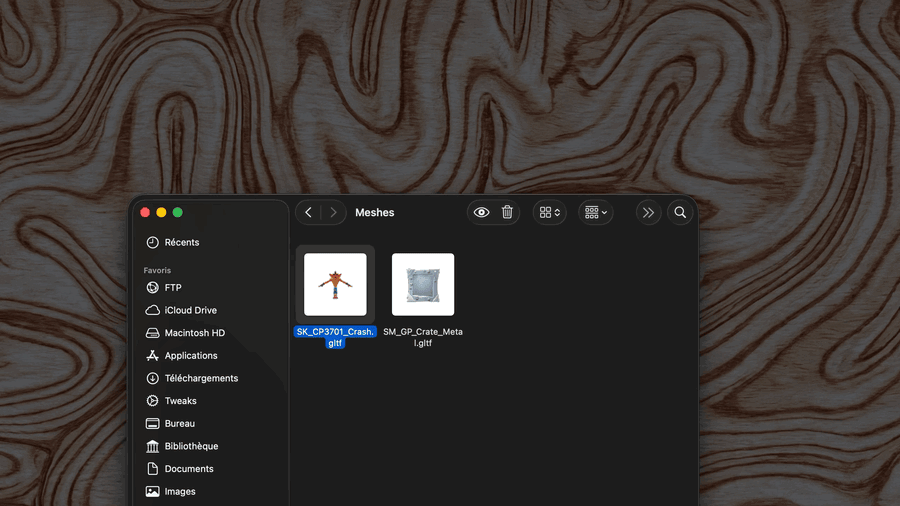

# GLTFQuickLook

Finder thumbnails and interactive Quick Look previews for `.gltf` and `.glb`
files on modern macOS.



## Modern Extension

The modern application is the recommended version for macOS 12 and later. The
current downloadable build targets Apple Silicon. It embeds both a Quick Look
preview extension and a Finder thumbnail extension.

Highlights:

- Interactive SceneKit previews with a native transparent Quick Look background.
- Finder thumbnails for binary GLB and sidecar-based glTF documents.
- Automatic preparation of downloaded and user-selected glTF folders.
- Support for dense Sketchfab exports and large uModel documents.
- Optional Unreal material reconstruction from sibling `.props.txt` and texture files.
- Oversized animated exports retain their first 10 animation clips in the prepared cache.
- Source models are never rewritten; compatibility data is stored in extended attributes.

## Install

The beta download is ad hoc signed rather than Apple-notarized. macOS may show a
warning because the build does not come from the App Store or an identified
developer.

1. Download `GLTFQuickLook-1.1.0-beta.1-macos-arm64.zip` from this repository's
   [Releases](https://github.com/Hectorlizard/GLTFQuickLook/releases) page.
2. Move `GLTFQuickLook.app` to `/Applications`.
3. Open the app. If macOS blocks it, open **System Settings > Privacy & Security**,
   click **Open Anyway**, then confirm.
4. If Quick Look still refuses to load the extensions, run:

   ```bash
   xattr -dr com.apple.quarantine /Applications/GLTFQuickLook.app
   open /Applications/GLTFQuickLook.app
   ```

5. Keep the `GLTFQL` menu-bar app running. `~/Downloads` is monitored
   automatically; use **Ajouter des dossiers...** in the menu for other model libraries.

Select a `.gltf` or `.glb` file in Finder and press Space. Thumbnail preparation
can take a little while when a folder contains many large models.

## Privacy and Storage

GLTFQuickLook works locally and does not upload models or usage data. The host app
monitors `~/Downloads` plus folders explicitly selected by the user. For sidecar
glTF documents, it stores a self-contained prepared copy as an extended attribute
on the source `.gltf`; the original file and its animation set remain unchanged.

Extended attributes work well on APFS and most local macOS volumes, but some
network, cloud, archive, or non-Mac filesystems can remove them or impose a size
limit. In that case the original model can still be opened by other software, but
the prepared Quick Look cache may need to be regenerated.

## Troubleshooting

If previews disappear after a macOS update or after replacing the app:

```bash
open /Applications/GLTFQuickLook.app
qlmanage -r
killall Finder
```

Then use **Reanalyser les dossiers** from the `GLTFQL` menu. Avoid installing two
copies of the app at the same time because macOS may register the wrong extension
bundle.

## Build

The modern project requires Xcode, Swift Package Manager, and
[XcodeGen](https://github.com/yonaskolb/XcodeGen). GLTFSceneKit is pinned to the
revision validated for this release.

```bash
brew install xcodegen
xcodegen generate --spec ModernAppExtension/project.yml
xcodebuild \
  -project ModernAppExtension/GLTFQuickLook.xcodeproj \
  -scheme GLTFQuickLook \
  -configuration Release \
  build
```

Run `Scripts/package-release.sh` to produce the same ad hoc signed Apple Silicon
ZIP and SHA-256 checksum used by the GitHub release workflow.

## Legacy Plugin

The original `.qlgenerator` implementation remains in this repository for older
macOS versions. Apple no longer supports that extension mechanism on current
macOS releases. See the [original project](https://github.com/magicien/GLTFQuickLook)
for its historical installation instructions.

## Credits

GLTFQuickLook was created by [magicien](https://github.com/magicien). The modern
App Extension and current compatibility work are maintained by
[Hectorlizard](https://github.com/Hectorlizard).

Released under the [MIT License](LICENSE).
